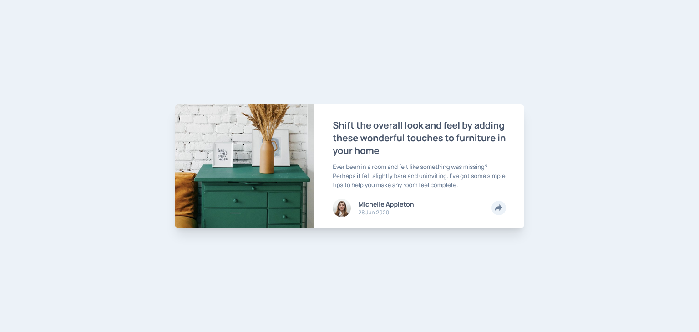
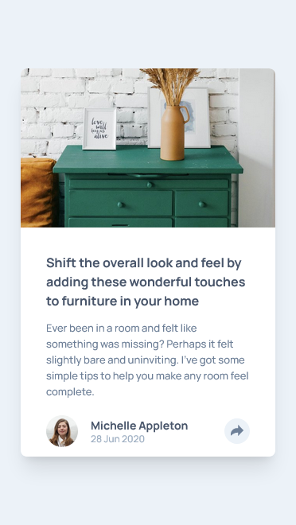

# Frontend Mentor - Article preview component solution

This is a solution to the [Article preview component challenge on Frontend Mentor](https://www.frontendmentor.io/challenges/article-preview-component-dYBN_pYFT). Frontend Mentor challenges help you improve your coding skills by building realistic projects.

## Table of contents

- [Overview](#overview)
  - [The challenge](#the-challenge)
  - [Screenshot](#screenshot)
  - [Links](#links)
  - [Built with](#built-with)
- [Author](#author)

## Overview

### The challenge

Users should be able to:

- View the optimal layout for the component depending on their device's screen size
- See the social media share links when they click the share icon

### Screenshot

### Links

- Solution URL: [Github Repo](https://github.com/yash-278/Frontend-Mentor-Challenges/tree/main/Article-Preview-Component)
- Live Site URL: [Live Demo](https://yash-278.github.io/Frontend-Mentor-Challenges/Article-Preview-Component/index.html)

## My process

### Built with

- Semantic HTML5 markup
- Flexbox
- [TailwindCss](https://tailwindcss.com/) - For styles

## Author

- Website - [Yash Kadam](https://www.yashkadam.cf)
- Frontend Mentor - [@yash-278](https://www.frontendmentor.io/profile/yash-278)
- Github - [@yash-278](https://github.com/yash-278)
